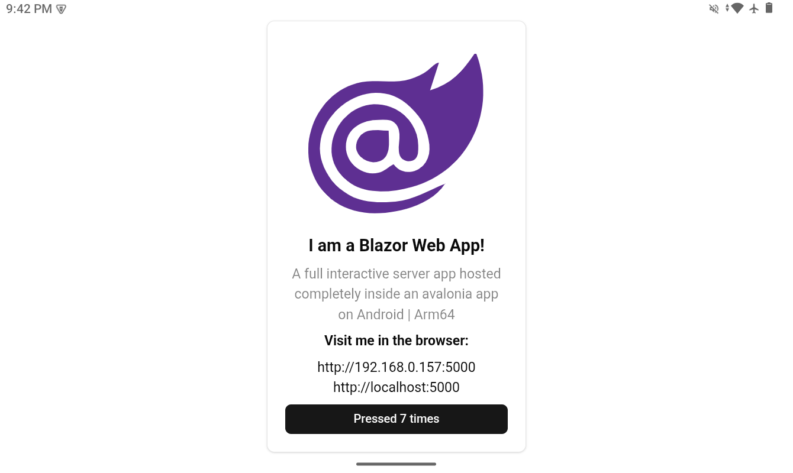

## Avalonia Embedded Blazor Web App Host (Interactive Server)
This project demonstrates running a Blazor Web App Server from an Android device (or desktop), accessible via UI (webview), browser, or other devices on the same network. The Android app runs the server in a foreground service, keeping it active even when backgrounded.



### Want to try it out?
- Clone the repo and run the `AvaloniaBlazorServer.Android` project, or run the desktop project `AvaloniaBlazorServer.Desktop`.
- Download the apk from the [releases](https://github.com/russkyc/avalonia-blazor-server/releases) and install it on your android device.

### Rationale
Officially, ASP.NET Core and Blazor Web Apps are not supported on Android. This project is a proof of concept for cross-platform hosting, using workarounds and automation to enable full server-side Blazor on mobile and desktop.

#### Example use cases (mobile-first, no PC required):
- Gaming LAN host (phone hotspot mode)
- Pop-up office in low-connectivity areas
- Field operations and inspections
- Portable team hub / command center
- Classroom/training/demo environments
- Kiosk + supervisor access
- Emergency fallback mode

### Overview
The project uses automated asset syncing and embedding for cross-platform hosting. Manual copying of framework assets and wwwroot content is no longer required. The build process is handled by the custom `ServerApp.targets` MSBuild file, which syncs all necessary framework and library assets from NuGet packages during build.

#### Key Points:
- `Microsoft.NET.Sdk.Web` cannot be used on Android, so the Blazor web app uses `Microsoft.NET.Sdk.Razor` and is set as a class library.
- The `ServerApp.targets` file automates syncing of framework assets (like `blazor.web.js`) and library assets to the `wwwroot` folder.
- The wwwroot content is embedded as resources, eliminating the need for manual copying.


### Minimal Example
Below are sample snippets for a minimal recreation of the setup:

**ServerApp.csproj**
> Most framework and asset-related packages (such as `Microsoft.AspNetCore.App.Internal.Assets`, `Microsoft.Extensions.FileProviders.Embedded`, etc.) and ASP.NET Core DLL references are automatically handled by the imported `ServerApp.targets` file. For a minimal setup, you do not need to add any project-specific packages.
```xml
<Project Sdk="Microsoft.NET.Sdk.Razor">
  <PropertyGroup>
    <TargetFramework>net10.0</TargetFramework>
    <OutputType>Library</OutputType>
    <Nullable>enable</Nullable>
    <ImplicitUsings>enable</ImplicitUsings>
  </PropertyGroup>
  <Import Project="ServerApp.targets" />
</Project>
```

#### What ServerApp.targets Does
The `ServerApp.targets` file is a custom MSBuild targets file that automates much of the setup required to run a Blazor Web App on Android and desktop. Its main functions are:
- **Automatic Package References:** Adds required packages for ASP.NET Core, Blazor, and file providers, so you do not need to manually include them in your `.csproj`.
- **DLL Injection:** Injects ASP.NET Core DLL references from your local dotnet installation, removing unnecessary or conflicting DLLs.
- **Static Web Asset Configuration:** Sets MSBuild properties to enable static web asset embedding and proper asset handling.
- **Asset Syncing:** Copies framework and library assets from NuGet packages to your project's `wwwroot` during build, ensuring all required files are available.
- **Clean-up:** Removes synced assets from `wwwroot` when you run a build clean, preventing stale files.

This automation allows your project files to remain minimal and portable, while ensuring all necessary dependencies and assets are handled for you.

**ServerAppHost.cs**
```csharp
using Microsoft.AspNetCore.Builder;
using Microsoft.AspNetCore.Hosting;
using Microsoft.Extensions.FileProviders;
using Microsoft.Extensions.Hosting;

namespace ServerApp;

public static class ServerAppHost
{
    public static Task Start(CancellationToken token = default, int port = 5000, bool broadcast = true)
    {
        var builder = WebApplication.CreateBuilder();
        builder.WebHost.ConfigureKestrel((_, opts) => opts.Listen(broadcast ? System.Net.IPAddress.Any : System.Net.IPAddress.Loopback, port));
        builder.WebHost.UseStaticWebAssets();
        builder.Services.AddRazorComponents().AddInteractiveServerComponents();
        var app = builder.Build();
        var embeddedProvider = new EmbeddedFileProvider(typeof(ServerAppHost).Assembly, $"{typeof(ServerAppHost).Assembly.GetName().Name}.wwwroot");
        app.UseStaticFiles(new StaticFileOptions { FileProvider = embeddedProvider });
        app.MapRazorComponents<App>().AddInteractiveServerRenderMode();
        return app.WaitForShutdownAsync(token);
    }
}
```

**AvaloniaBlazorServer.csproj**
```xml
<Project Sdk="Microsoft.NET.Sdk">
  <PropertyGroup>
    <TargetFramework>net10.0</TargetFramework>
    <Nullable>enable</Nullable>
    <LangVersion>latest</LangVersion>
    <AvaloniaUseCompiledBindingsByDefault>true</AvaloniaUseCompiledBindingsByDefault>
  </PropertyGroup>
  <ItemGroup>
    <PackageReference Include="Avalonia"/>
    <PackageReference Include="WebView.Avalonia" />
    <!-- other Avalonia packages as needed -->
  </ItemGroup>
  <ItemGroup>
    <ProjectReference Include="..\ServerApp\ServerApp.csproj" />
  </ItemGroup>
</Project>
```

**AvaloniaBlazorServer.Android.csproj**
```xml
<Project Sdk="Microsoft.NET.Sdk">
  <PropertyGroup>
    <OutputType>Exe</OutputType>
    <TargetFramework>net10.0-android</TargetFramework>
    <Nullable>enable</Nullable>
    <AndroidEnableProfiledAot>false</AndroidEnableProfiledAot>
    <RunAOTCompilation>false</RunAOTCompilation>
    <PublishAot>false</PublishAot>
    <!-- other Android properties as needed -->
  </PropertyGroup>
  <ItemGroup>
    <PackageReference Include="Avalonia.Android"/>
    <PackageReference Include="WebView.Avalonia.Android" />
    <!-- other Android packages as needed -->
  </ItemGroup>
  <ItemGroup>
    <ProjectReference Include="..\AvaloniaBlazorServer\AvaloniaBlazorServer.csproj"/>
    <ProjectReference Include="..\ServerApp\ServerApp.csproj" />
  </ItemGroup>
</Project>
```

**AvaloniaBlazorServer.Desktop.csproj**
```xml
<Project Sdk="Microsoft.NET.Sdk">
  <PropertyGroup>
    <OutputType>WinExe</OutputType>
    <TargetFramework>net10.0</TargetFramework>
    <Nullable>enable</Nullable>
  </PropertyGroup>
  <ItemGroup>
    <PackageReference Include="Avalonia.Desktop"/>
    <PackageReference Include="WebView.Avalonia.Desktop" />
    <!-- other desktop packages as needed -->
  </ItemGroup>
  <ItemGroup>
    <ProjectReference Include="..\AvaloniaBlazorServer\AvaloniaBlazorServer.csproj"/>
  </ItemGroup>
</Project>
```

**Android Project Setup**
- Add permissions to `AndroidManifest.xml`:
```xml
<uses-permission android:name="android.permission.INTERNET" />
<uses-permission android:name="android.permission.POST_NOTIFICATIONS" />
<uses-permission android:name="android.permission.FOREGROUND_SERVICE"/>
<uses-permission android:name="android.permission.FOREGROUND_SERVICE_SPECIAL_USE"/>
<uses-permission android:name="android.permission.WAKE_LOCK" />
```
- Foreground service sample:
```csharp
[Service(Enabled = true, Exported = false, ForegroundServiceType = ForegroundService.TypeSpecialUse)]
public class HostService : Service
{
    private readonly CancellationTokenSource _tokenSource = new();
    private Task? _serverTask;
    public override StartCommandResult OnStartCommand(Intent? intent, StartCommandFlags flags, int startId)
    {
        _serverTask = ServerAppHost.Start(_tokenSource.Token);
        return StartCommandResult.Sticky;
    }
    public override void OnDestroy()
    {
        _tokenSource.Cancel();
        _serverTask?.Wait();
        base.OnDestroy();
    }
    public override IBinder? OnBind(Intent? intent) => null;
}
```

### Remaining Limitations and Next Steps
- iOS support is still untested; explore workarounds as needed.

### Special thanks
Credit to [ASP.NET Core in Maui](https://github.com/JamesNK/aspnetcore-maui) for inspiring the workarounds to run ASP.NET unofficially in Maui and on mobile.